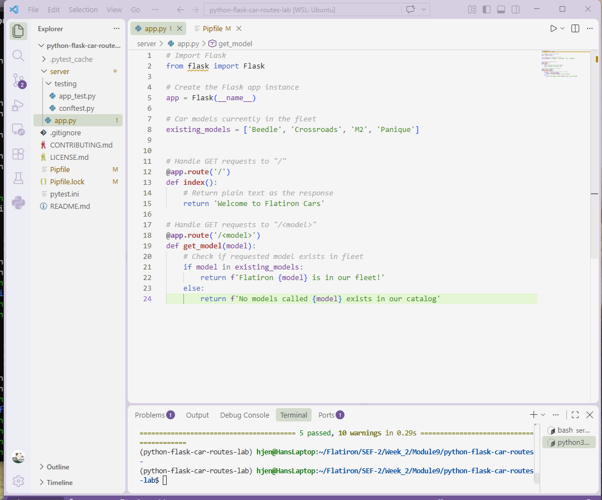

# Flatiron Car Routes

A small Flask application that serves routes for a fictional car dealership, Flatiron Cars.

## Description

This app exposes two routes:

- `GET /` → returns a welcome message
- `GET /<model>` → checks a requested car model against the dealership's existing fleet and returns whether it's available

## Screenshot



## Installation

Clone the repo, then install dependencies with pipenv:

```bash
pipenv install
pipenv shell
```

## Usage

Run the Flask app, then visit:

- `/` → displays a welcome message
- `/<model>` (e.g. `/Crossroads`) → checks if the given model is in the fleet

Example responses:

- `/Crossroads` → `Flatiron Crossroads is in our fleet!`
- `/realCar` → `No models called realCar exists in our catalog`

## Testing

```bash
cd server
pytest
```

All 5 tests should pass.

## Contributing

1. Fork the repo
2. Create a feature branch
3. Commit your changes with clear messages
4. Open a pull request against `main`

